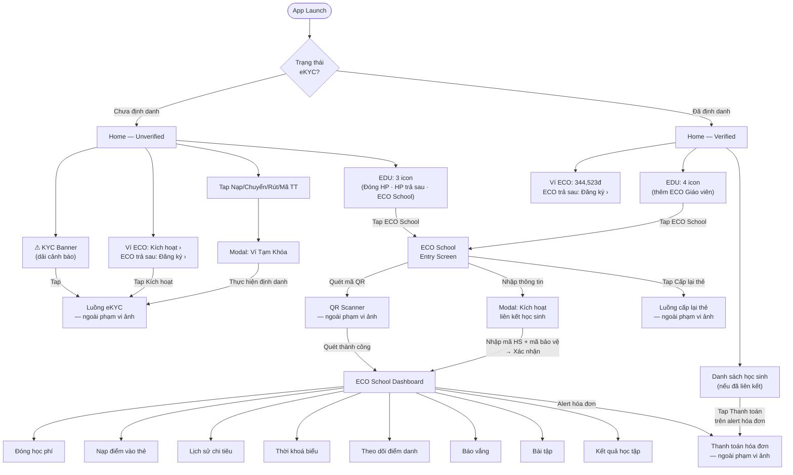
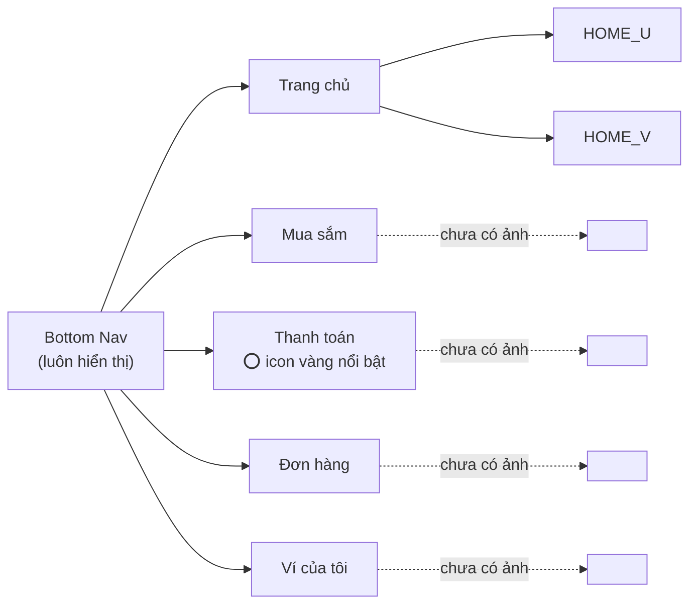
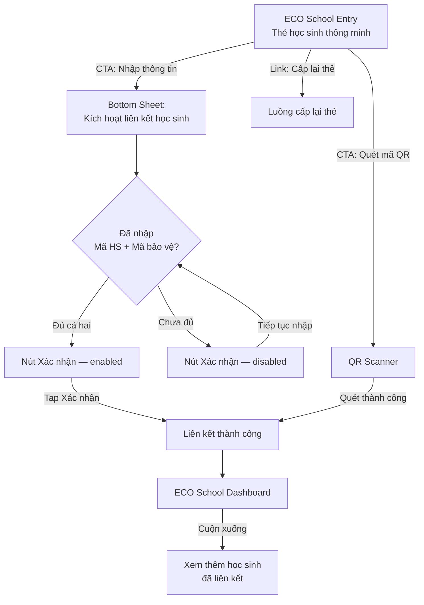

# Flows — ECO Me Navigation

Sơ đồ luồng điều hướng giữa các màn hình, dựa trên ảnh chụp thực tế.

---

## Tổng quan luồng ứng dụng

---

## Luồng Bottom Navigation

---

## Luồng liên kết học sinh (chi tiết)

---

## Ghi chú

- **Nét liền (→):** luồng có trong ảnh chụp
- **Nét đứt (-.->):** tab/màn hình tồn tại trong nav nhưng chưa có ảnh
- ECO School truy cập được ở cả hai trạng thái Verified và Unverified (không bị chặn bởi eKYC)
- Ví tạm khóa chỉ chặn các giao dịch tài chính (Nạp/Chuyển/Rút/Mã TT), không chặn ECO School
